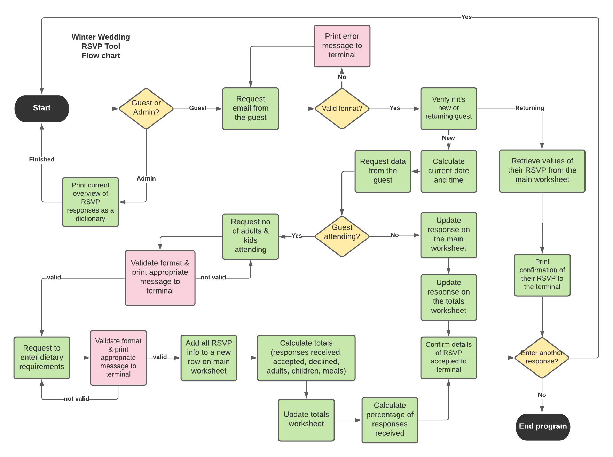
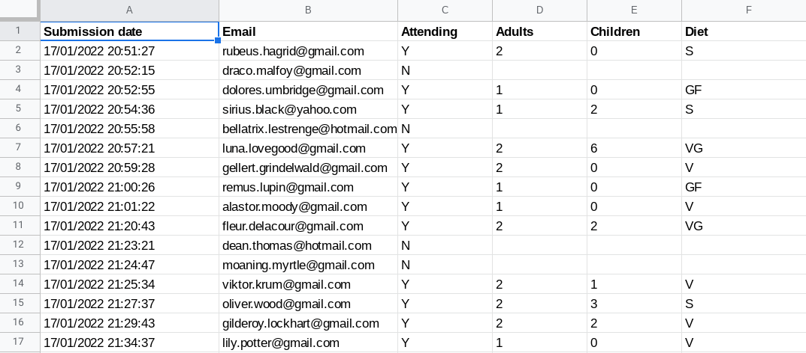
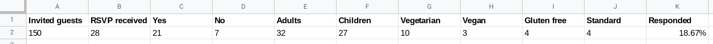
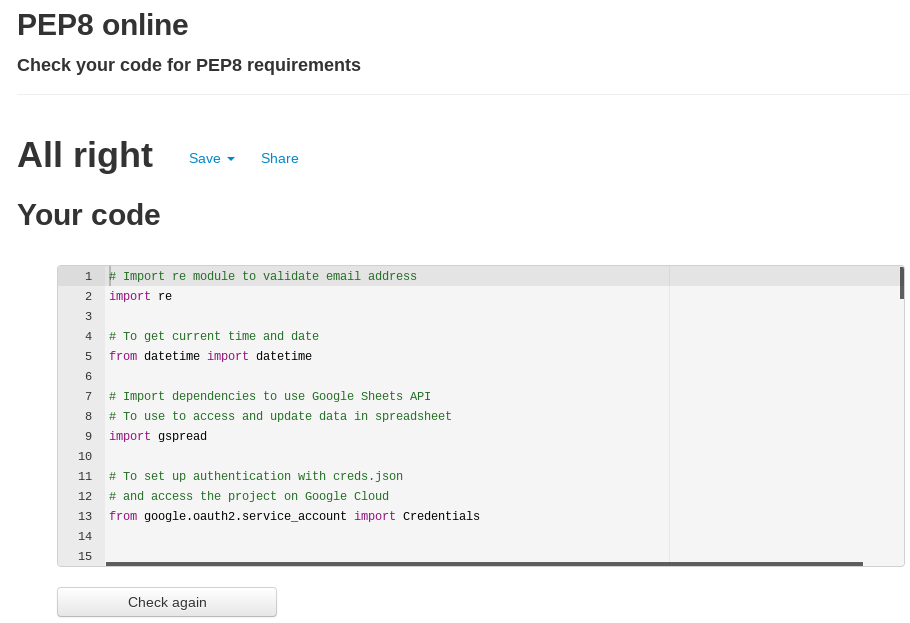

# Table of Contents 

1. [**Introduction**](#Introduction)
2. [**User Experience (UX)**](#User-Experience-(UX))
    * [Project goals](#Project-goals)
    * [Target audience](#Target-audience)
    * [User stories](#User-stories)
    * [Structure](#Structure)
    * [Design](#Design)

3. [**Features**](#Features)
    * [Existing Features](#Existing-Features)
    * [Features to be implemented in the future](#Features-to-be-implemented-in-the-future)

4. [**Technologies used**](#Technologies-used)

5. [**Deployment**](#Deployment)
    * [Deploying to Heroku](#Deploying-to-GitHub-Pages)
    * [Forking to GitHub Repository](#Forking-to-GitHub-Repository)
    * [Making a local clone](#Making-a-local-clone)

6. [**Testing**](#Testing)
    * [Testing Approach](#Testing-Approach)
    * [User stories testing from the UX section](#User-stories-testing-from-the-UX-section)
    * [Validator Testing](#Validator-Testing)
    * [Issues and Bugs](#Issues-and-Bugs)

7. [**Credits**](#Credits)

8. [**Acknowledgments**](#Acknowledgments)

9. [**Disclaimer**](#Disclaimer)

<br>

# Winter Wedding RSVP

[Live program](https://winter-wedding.herokuapp.com/)

<br>

## Introduction
---

Winter Wedding RSVP tool is a terminal based application that allows users to RSVP to a wedding invite they had received.
It works with Google Sheets to record and retrieve individual responses, as well as to calculate totals and return them to the admin of the application.
The data can then be used for further planning linked to the event.


## User Experience (UX)
---
### Project goals

* to provide a tool for wedding guests they can use to send their RSVP
* to record their responses in an organised data file
* to track and monitor responses submitted

### Target audience

* Specific group of guests and their families who had been invited to a wedding

### User stories:

* as an invited guest, I want to be able send my RSVP
* as an invited guest, I want to be able to see a confirmation of my responses
* as a user, I want to clearly understand what actions are required
* as a user, I want to be clearly notified about any errors during the RSVP process
* as a returning user, I want to be notified if my response had already been recorded and what it said
* as an admin of the tool, I want to be able to access overview of RSVPs received

### Structure:

* Flowchart



* Database Structure

Google Sheet with 2 worksheets: *main* and *totals*

*Main worksheet*



*Totals worksheet*



### Design: 

As this is a terminal based application, the design is limited. 
I have kept the basic terminal colours and fonts as per the Code Institute's template used.
The only addition to the design is the intro logo shown when the program starts. It illustrates the purpose of the tool and entices the user to interact with it.

## Features
---

### Existing Features

* Option to access the tool as a wedding guest or wedding coordinator (to preview admin summary of all RSVPs received)
* Intro image and welcome message: 


* Series of questions with requests for user input that gets recorded on the Google Sheet
* Checking for duplicated response attempt and printing back a message to the user
* Recording totals of RSVP details, tracking % of responses received and preparing a live admin overview
* End message with option to start again

### Features to be implemented in the future

Due to time constraints, I was unable to implement all planned features. In the future, I'd like to add the following:

* Option for the user to quit the RSVP flow - at the moment, they have to complete the selected flow or press Run Program button
* Option for the returning guest to cancel or amend their RSVP
* Automation to send out emails with confirmation to the guest and to the admin using Zapier 
* Add authorisation option to access admin overview

## Technologies used
---

* [Python](https://en.wikipedia.org/wiki/Python_(programming_language)) - language used for this project
* [Code Institute Template](https://github.com/Code-Institute-Org/python-essentials-template) - to display and run the command line terminal in the browser
* [Google Sheets](https://www.google.com/sheets/about/) - to store and organise data
* [Google Cloud Platform](https://console.cloud.google.com/) - for APIs and credentials to access Google Sheets
* [gsptread](https://pypi.org/project/gspread/) - to access, update and manipulate data from Google Sheets
* [re](https://docs.python.org/3/library/re.html) - for regular expression to validate email syntax
* [google.oauth2.service_account](https://google-auth.readthedocs.io/en/master/reference/google.oauth2.service_account.html) - to authenticate and authorize the application
* [datetime](https://docs.python.org/3/library/datetime.html) - for creating the timestamp
* [Lucidchart](https://www.lucidchart.com/) - to create the flowchart
* [Heroku](https://heroku.com/) - for presenting the deployed project
* [GitHub](https://github.com/) - for hosting the project code and version control 
* [Gitpod](https://gitpod.io/) - to write the code and push it to GitHub
* [PEP8 Online Validation Service](http://pep8online.com/) - to validate the code
* [Online-Spellcheck](https://www.online-spellcheck.com/) - to spellcheck the README

## Deployment
---
### Deploying to Heroku

The project was developed in GitPod, committed to Git and pushed to GitHub. 
The site was deployed to Heroku with the following steps:

1. In GitPod, import the required dependencies to the requirements.txt file, using 
> pip3 freeze > requirements.txt
2. Git add, commit and push the saved changes to GitHub. Heroku will use this file to import the dependencies that are required.
3. Sign up and log in to [Heroku](https://heroku.com).
4. On the dashboard, click **New** in the top right-hand corner and select **Create New App**.
5. Select a *unique* name for your application and choose your region (Europe in my case).
6. Click **Create App**.
7. Navigate to the Settings tab (must be done before deploying code)
8. Go to section **Config Vars**, click button "Reveal Config Vars" and press "Add" button
9. In the "KEY" field: type "CREDS" (all capital letters) and in the "VALUE" field: paste the copied content of "creds.json" file from GitPod
10. Click "Add" and add another key "PORT" and value "8000"
11. Go to the Settings tab and scroll down to **Buildpacks**. Select and save: 'Python', then repeat and select and save: 'Node.js'. (has to be in this order, drag and drop if needed)
12. Navigate to the Deploy tab and scroll down to **Deployment Method**.
13. Select GitHub as deployment method.
14. Enter the name of the repository you want to connect to and click **Connect**.
15. Select one of the deployment options - Automatic Deployments or Manual - to deploy the app.
16. Once sucessfully deployed, a **View** button will appear and take you to a mock terminal.


### Forking to GitHub Repository

You can create a fork (copy) of the repository. This allows you to experiment with the code without affecting the original project.

To fork the repository:

1. Log in to your [GitHub](https://github.com/) account 
2. On GitHub, navigate to the repository you want to fork
3. In the top right corner of the page, underneath your profile avatar, click **Fork**
4. You should now have a copy of the original repository in your GitHub account

### Making a local clone

You can clone your repository to create a local copy on your computer. Any changes made to the local copy will not affect the original project. To clone the **Winter Wedding** project, follow the steps below:

1. Log in to your [GitHub](https://github.com/) account and locate the [Winter Wedding repository](https://github.com/renatabiniek/winter-wedding)
2. In the repository, click on **Code** button located above all the project files
3. Under HTTPS, copy the link generated (https://github.com/renatabiniek/winter-wedding.git)
4. Open the terminal you're using, e.g. Gitpod
5. Change the current working directory to the location where you want the cloned directory created
6. Type ```git clone``` and then paste the URL you copied earlier:  
```git clone https://github.com/renatabiniek/winter-wedding.git``` 
7. Press **Enter** to create your local clone.

You can also refer to this [GitHub documentation](https://docs.github.com/en/github/creating-cloning-and-archiving-repositories/cloning-a-repository-from-github/cloning-a-repository) for detailed instructions. 

## Testing
---

### Testing Approach

* I tested the program regularly during the development proces. I relied on multiple print statements to understand which part of the code is getting executed and causes any potential issues. Once the app was deploued to the mock terminal on Heroku, I manually tested the program, by following all available user paths.
Any issues found, were addressed at that stage and double checked before moving on with the rest of the project.

* I tested input validation by:
  * entering email address in incorrect format
  * entering email address that already is on the Google Sheet
  * entering values that don't match the expected values (response: Y/N, diet: V/VG/GF/S, end: G/A)
  * entering incorrect number of guests (adults = 0 or > 2, kids > 6) 
  * entering guest data in incorrect format (not exactly 2 numbers separated by a comma)


* The program has been tested on various browsers on desktop and mobile:

  * Chrome
  * Mozila Firefox
  * Edge
  * Safari 

 Although not responsive on mobiles, the program still is displayed and works as expected.
 The only issue on some mobile phones was with input autofill, where random characters where pre-populating in the input field. 
 Once overriden, input was getting accepted.

### User stories testing from the UX section

I tested the program considering the user stories from the UX section as well.

* as an invited guest, I want to be able send my RSVP

  **Test result:**  PASS

  User is lead through a series of RSVP questions and their answers are recorded once they complete the path.

* as an invited guest, I want to be able to see a confirmation of my responses

  **Test result:**  PASS

  Detailed confirmation of the repsonses is printed in the terminal at the end of the path.

* as a user, I want to clearly understand what actions are required

  **Test result:**  PASS

  Each question has clear instruction as for the detials and format required, available options are cleary presented and user is informed how to select them.

* as a user, I want to be clearly notified about any errors during the RSVP process

  **Test result:**  PASS

  Each time incorrect value is entered, the user sees details of the error in the terminal, and has an option to enter data again until it's valid.

* as a returning user, I want to be notified if my response had already been recorded and what it said

  **Test result:**  PASS

  The program looks up the provided email address on the Google Sheet, and if email is already recorded, it informs the user and prints details of the RSVP in the terminal. 

* as an admin of the tool, I want to be able to access overview of RSVPs received

  **Test result:**  PASS

  Admin can request the admin overview that is calculated based on the current data on the Google Sheet. The overview is printed in the terminal.

### Validator Testing

I used PEP8 Online Validation Service to regulary check and validate the code. I've been resolving any issues as they come up.
Main errors were to do with line length, whitespaces, however there were also a few that cought invalid syntax and unused variables.
The final validation result contains no errors:




### Issues and Bugs

* This project is my first attempt at using Python, so I ran into multiple general issues with indentation, correct order of calling appropriate functions and if/else statement logic. I've managed to resolve them refering to course materials and researching online.

* Issue with length of regex line: I used this advice from [Stackoverflow](https://stackoverflow.com/questions/8006551/how-to-split-long-regular-expression-rules-to-multiple-lines-in-python/8006576#8006576) to split the long expression

* Request to input dietary requirements (get_diet()) was running even if the guest responded that they're not attending the event. This was due to the conditional statement in my main() function, where all other functions would run if the user was validated as new. I changed the logic and now when the RSVP is N, there are no further request for input.

* sum() function wouldn't work properly at first when calculating total number of kids. This was due to empty cells in the column. I resolved this using list comprehension that would only get values from the colum if there was a value in a cell. As this was used to simply sum the values, I didn't need to worry about the potential misalignmed where row number might be important. I followed [this post on Stackoverflow](https://stackoverflow.com/questions/45134764/getting-all-column-values-from-google-sheet-using-gspread-and-python) to achieve this.

* Count of adults and children wasn't increasing as expected at one point - this was due to incorrect order of functions called in main(). The count functions use data from the main worksheet but were called before the current RSVP data was added to the main worksheet. Fixed the order of them to be called after the data is added.

* A list of new responses was getting attached to the previous row of responses in the main worksheet at one point. This happened after a while loop was added to display a final option to start the tool again. The issue was due to the use of the global variable rsvp_info. When user selected to start again, their responses were added to the existing list. This was solved by wiping the data in the rsvp_info list when program restarts.

* Known issue: There are multiple yellow warning messages in the terminal problems tab that relate to the image art used. Correcting them would distort the image so I left them as they are.

### Credits

* Love Sandwiches walk-through project by Code Institue has been used regulary as a reference when building this tool. Some code has been used and adjusted to fit the needs of this project.

* Image for the welcome message from [Ascii Art](https://www.asciiart.eu/holiday-and-events/valentine)

* Code to validate syntax of email address using regular expressions from [this article on Stackabuse](https://stackabuse.com/python-validate-email-address-with-regular-expressions-regex/)

* [Stackoverflow](https://stackoverflow.com/) in general, for providing answers on mulitiple occasions. Especially, advice on how to split long regex from [this post on Stackoverflow](https://stackoverflow.com/questions/8006551/how-to-split-long-regular-expression-rules-to-multiple-lines-in-python/8006576#8006576) and [this post on Stackoverflow](https://stackoverflow.com/questions/45134764/getting-all-column-values-from-google-sheet-using-gspread-and-python) to ignore empty cells in a colum 

### Acknowledgments

Thank you to:

* My mentor Guido Cecilio for the invaluable support and feedback.
* The community on Slack.
* My partner for continous support.

### Disclaimer

*This program has been created for educational purposes only, as part of Code Institute’s Python Essentials Portfolio Project 3.
The requirements are to build a command-line application that allows your users to manage a common dataset.*